# Lab #1: Storage

### Student: Olga Durham

### St#: 040687883

## Objective: 
Understand object storage built to retrieve any amount of data from anywhere, offering industry-leading scalability, data availability, security, and performance

---

1. Create an Azure blob/Storage account for region US East and select local redundant storage

- Screenshot should show the creation of Storage account, in the specified region and settings. Go to the storage account you created and Overview tab and take a screenshot showing those settings.

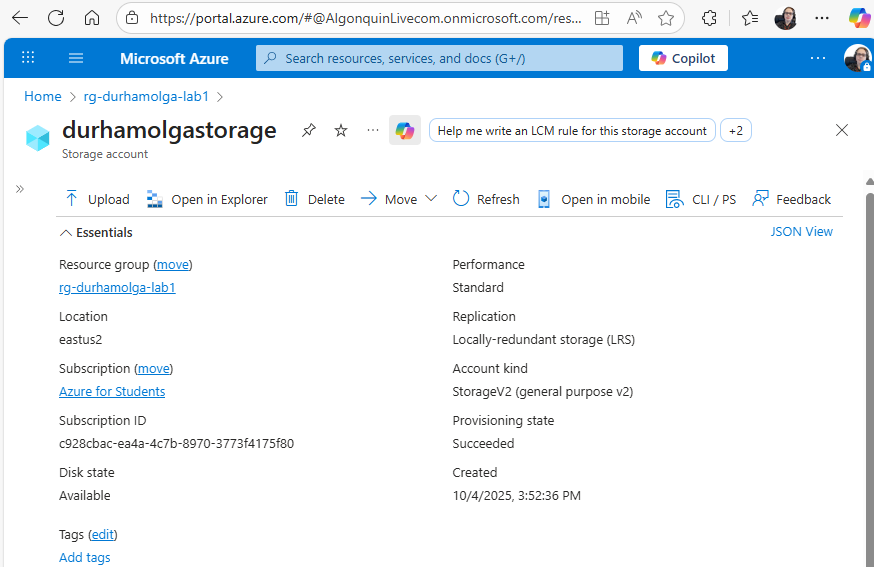

---

2. Add file named sample_container.csv objects to containers via GUI

- Screenshot should show that csv file has been added to the container

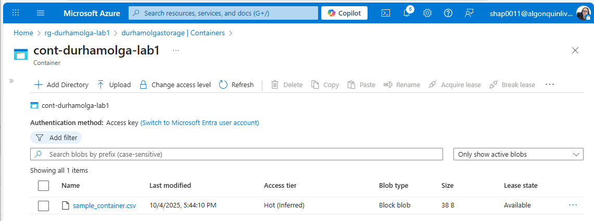

---

3. Create file share

- Screenshot should show that file share has been created

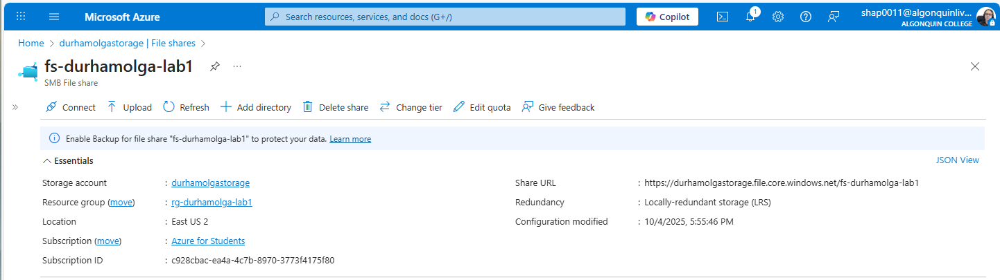

---

4. Work with objects in the containers, using AzCopy and download
sample_container.csv file to a local folder, take screenshot of AzCopy commands and output - NO USE OF SAS TOKEN IN COMMAND

- Screenshot should show terminal with command downloading csv file and file being downloaded, show entirety of the output

- Screenshot should show the csv file in your file explorer or whatever folder you’ve downloaded it to

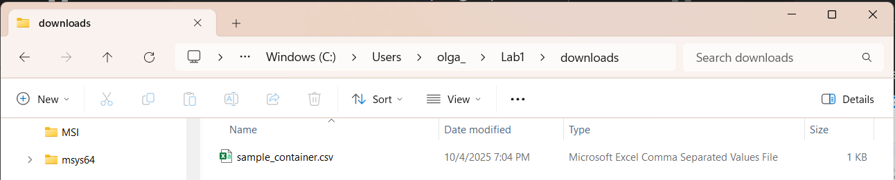

---

5. Add file named sample_fc.json to file share using SAS token via command line,
take screenshot of steps and output

- Screenshot should show you uploading the .json file via SAS token, so show where you found the SAS token in the azure portal

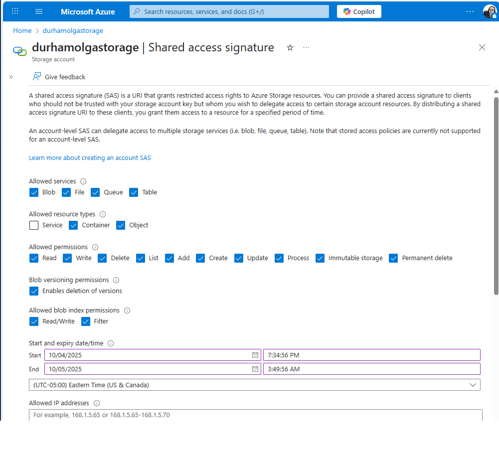

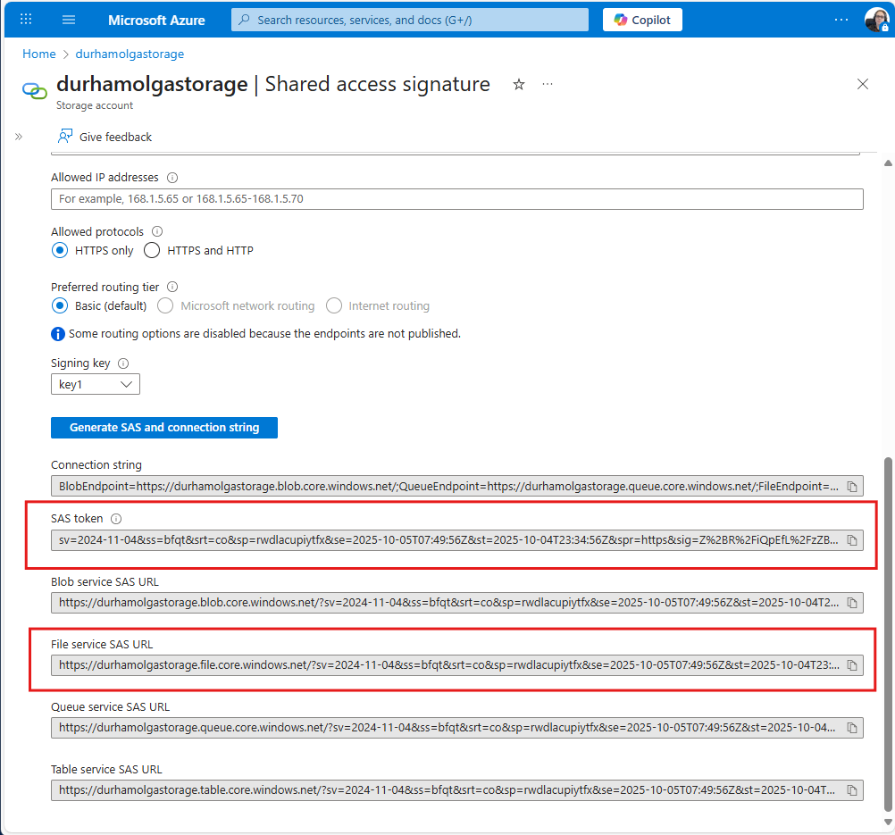

- Screenshot of command uploading .json file via SAS token and successful output command

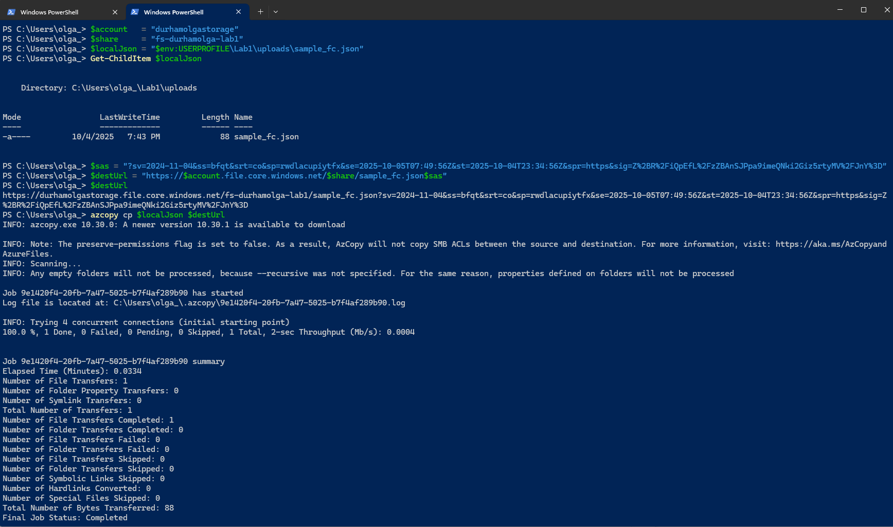

- Screenshot of the azure portal showing file has been uploaded

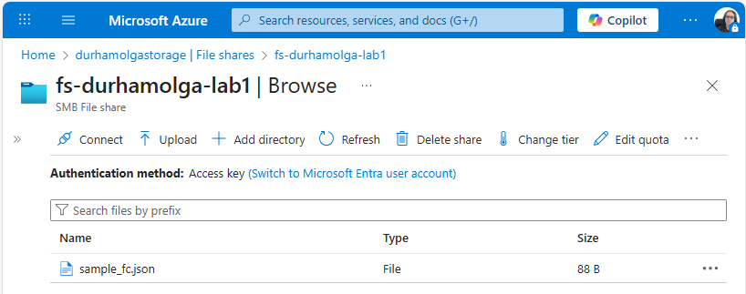

---

6. Check your current IAM policy for yourself

- Screenshot should show your current IAM policy that you have for that storage account

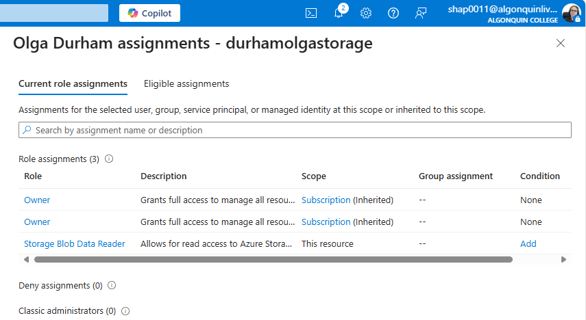

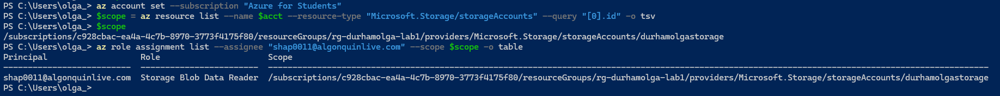

---

7. Create IAM policy for storage account, that is relevant to the service that would allow you to view all resources, but does not allow you to make any changes.

- Show each step of giving yourself the correct role

    7.1. Role Reader selected

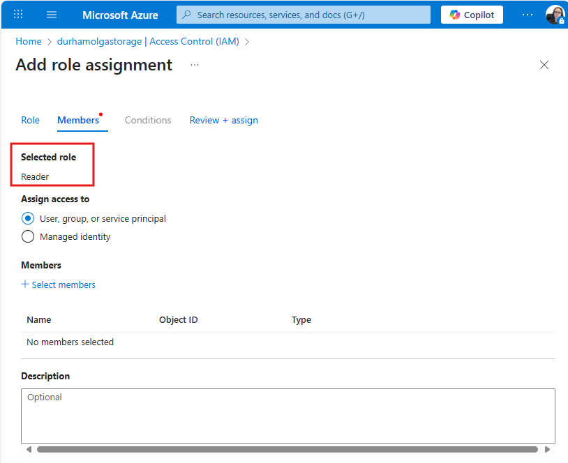

    7.2. Member selected

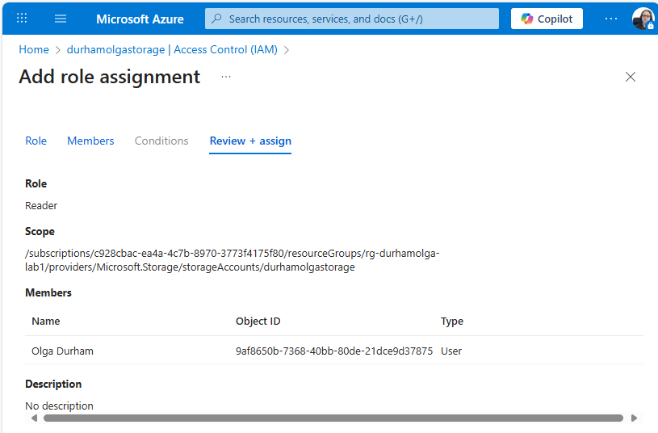

    7.3. Role assignment created

    7.4. My access pane showing Reader at the storage account scope

    7.5. My role assignments CLI

    7.6. Notification pane
    
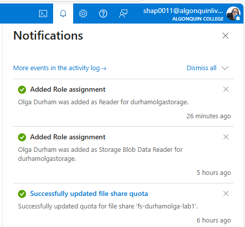

---

8. Delete container and contents created

- Show you deleting storage account or resource group and successful deleted message

---