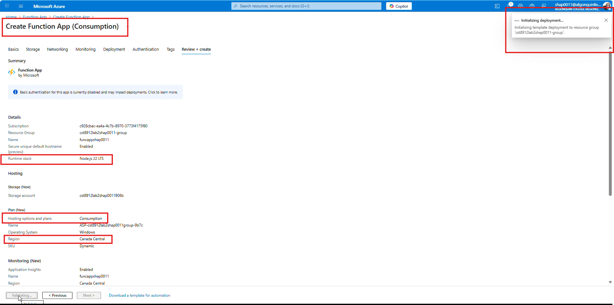

# Lab #2: Azure Functions

**Student: Olga Durham**

**Student#: 040687883**

---

**Objective:** Learn to deploy and manage azure functions in the cloud

---

## Main tasks for Azure:

### 1. Create storage account with Locally redundant storage setting and in the East US region (Score 1)

<u>_NOTE: the East US region is not available for 'Azure for Students' subscription_</u>

**Step 1:**

- Storage account, overview tab screenshot, that essentially displays, name of storage account, region, and redundancy setting ie Locally redundant storage

### 2. Create Azure function app, select any runtime stack or version, you prefer. But select East US region and Consumption hosting option (Score 2)

**Step 2:**

- Screenshot of process of create azure function app, displaying the setting you selected. Need to show the runtime stack, version, region, and consumption hosting option selected

### 3. Within the function app create an azure function, via the azure portal. Create an azure blob storage trigger function. Ensure your storage account connection is the storage account created in step 1 (Score 3)

**Step 3:**

- Screenshot of the process of creating the function app via azure portal. Ensure your storage account connection is the storage account created in step 1

### 4. Test/run the function where if an file gets uploaded in a container, the trigger succeeds (Score 5)

**Step 4:**

- Screenshot of the code of the function
- Screenshot of the .json file
- Screenshot of the Test/run Input file
- Screenshot of the output
- Copy the bottom output log and paste in word doc

### 5. Delete all resources, there will be quite a few created, check under resource group to ensure everything has been deleted (Score 1)

**Step 5:**

- Screenshot of your resource group service and no resources underneath the resource group

