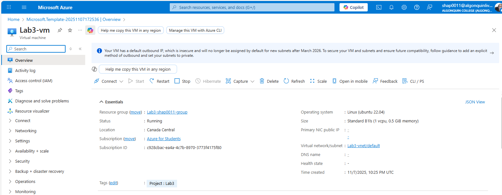
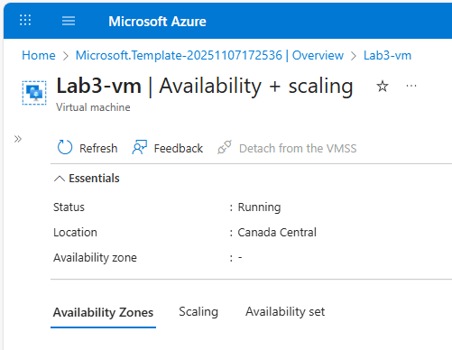
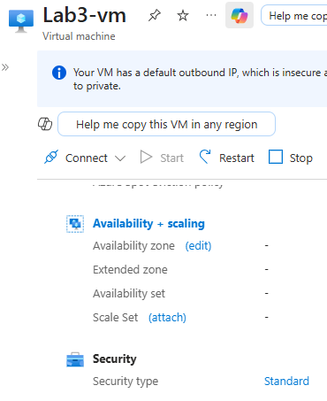
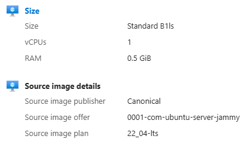
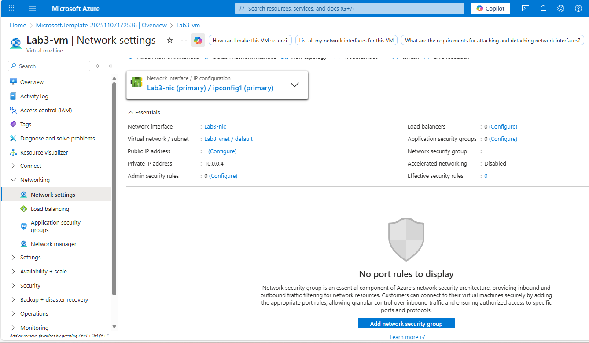
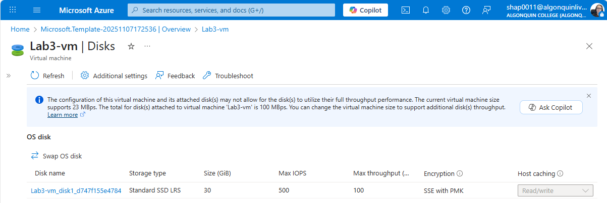
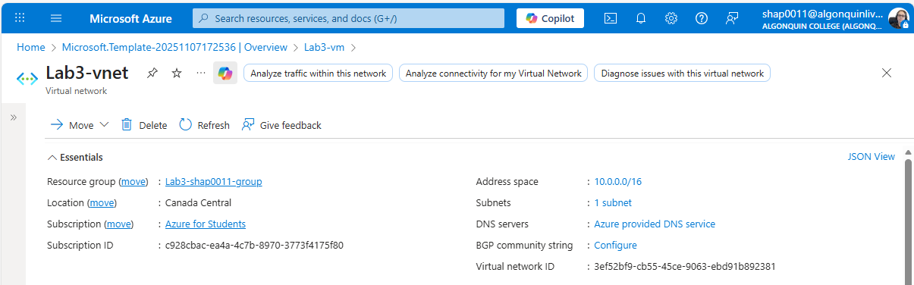
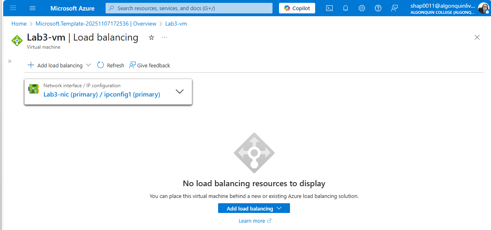
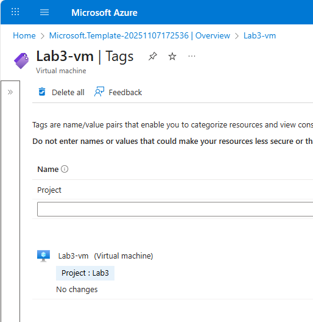
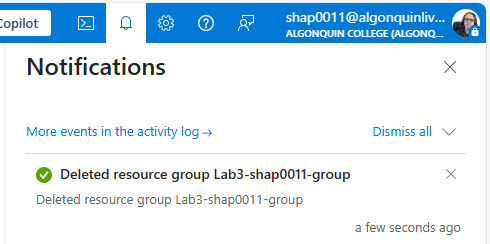

# Lab #3: Deploy Virtual Machine via Custom Templates

**Student: Olga Durham**

**Student#: 040687883**

---

## 1. Using the deploy a custom template azure service, create a custom template to deploy a linux virtual machine, that contains the following settings:

**a. Region: Canada Central (as "east us" doesn't work for the "Azure Student" subscription)**

- changed parameter 'location -> default value' to 'canadacentral'

```
"location": {
      "type": "string",
      "defaultValue": "canadacentral",
      "metadata": {
        "description": "Specifies the location for all resources."
      }
    }
```

**b. Availability Options: no infrastructure redundancy required**

_no changes needed_

**c. Security Type: standard**

- added to 'resources -> Microsoft.Compute/virtualMachines'

```
		"securityProfile": {
			"securityType": "Standard"
		},
```

**d. Image: ubuntu server 22.04 LTS**

- edited imageReference `sku` to the non-gen2

```
          "imageReference": {
            "publisher": "Canonical",
            "offer": "0001-com-ubuntu-server-jammy",
            "sku": "22_04-lts",
            "version": "latest"
          }
```

**e. Size: standard_b1ls -1 vcpu, 0.5 Gib memory**

- changed parameter 'vmSize -> default value' to 'standard_b1ls'

```
    "vmSize": {
      "type": "string",
      "defaultValue": "Standard_B1ls",
      "metadata": {
        "description": "Specifies the size of the virtual machine"
      }
    }
```

**f. Authentication type: password (include username and password in the template)**

- removed from template parameter "adminPublicKey"

- added a new parameter "adminPassword"

```
    "adminPassword": {
      "type": "securestring",
      "defaultValue": "myPassword_123",
      "metadata": {
        "description": "Specifies the password for the Virtual Machine."
      }
    }
```

- edited VM's osProfile section

```
        "osProfile": {
          "computerName": "[variables('vmName')]",
          "adminUsername": "[parameters('adminUsername')]",
          "adminPassword": "[parameters('adminPassword')]",
          "linuxConfiguration": {
            "disablePasswordAuthentication": false
          }
        }
```

**g. Public inbound ports: None**

- removed the public IP resource from template

- removed both NSG resources from template

- clean up JSON code

**h. Os Disk type: Standard SSD**

_no changes needed_

```
          "osDisk": {
            "createOption": "FromImage",
			"managedDisk": {
              "storageAccountType": "StandardSSD_LRS"
            }
          }
```

**i. Specify virtual network in the template**

_no changes needed, already satisfied with previous steps_

```
{
  "type": "Microsoft.Network/virtualNetworks",
  "apiVersion": "2020-05-01",
  "name": "[variables('vNetName')]",
  "location": "[parameters('location')]",
  "properties": {
    "addressSpace": {
      "addressPrefixes": [
        "[variables('vNetAddressPrefixes')]"
      ]
    },
    "subnets": [
      {
        "name": "[variables('vNetSubnetName')]",
        "properties": {
          "addressPrefix": "[variables('vNetSubnetAddressPrefix')]"
        }
      }
    ]
  }
}

```

```
"subnet": {
  "id": "[resourceId('Microsoft.Network/virtualNetworks/subnets', variables('vNetName'), variables('vNetSubnetName'))]"
}

```

**j. NIC network security Group: None**

_NO NIC network security Group_

**k. Load balancing options: None**

_NO Load balancing options_

l. Add a tag

- added tags block to all resources

```
  "tags": {
    "Project": "Lab3"
  }
```

Once created ensure it deploys and verify that the virtual machine was created /20

## 2. Delete resources created in this lab /1

### Screenshots:

<u>Step 1:</u>

Attach your json custom template as a separate file

[template.json](ExportedTemplate-Microsoft.Template-20251107172536/template.json)

Screenshot showing successful deployment from the custom template




So I can verify that the virtual machine from the json template was created. Screenshots should include verifications of each of the settings in step 1, so the screenshots should show the virtual machine once it is created and its settings ensure you display the

- Region
- Availability Options



- Security Type



- Image
- Size



- Public inbound ports



- Os Disk type



- virtual network



- Load balancing options



- tag that was created



<u>Step 2:</u>

Screenshot showing that all resources were deleted



---

REFERENCES:

1. [How to create a Linux virtual machine with Azure Resource Manager templates](https://learn.microsoft.com/en-us/azure/virtual-machines/linux/create-ssh-secured-vm-from-template)

2. [Data types in ARM templates](https://learn.microsoft.com/en-us/azure/azure-resource-manager/templates/data-types)
