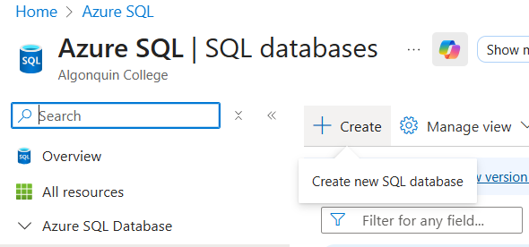
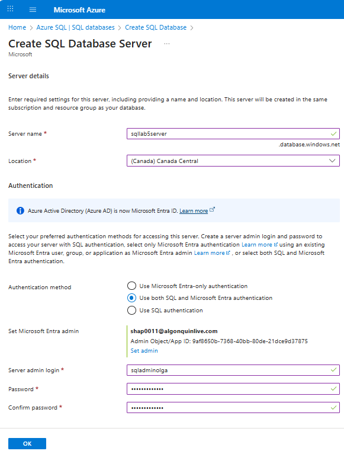
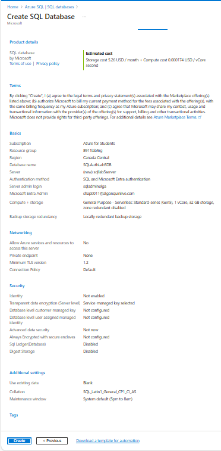
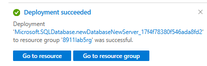
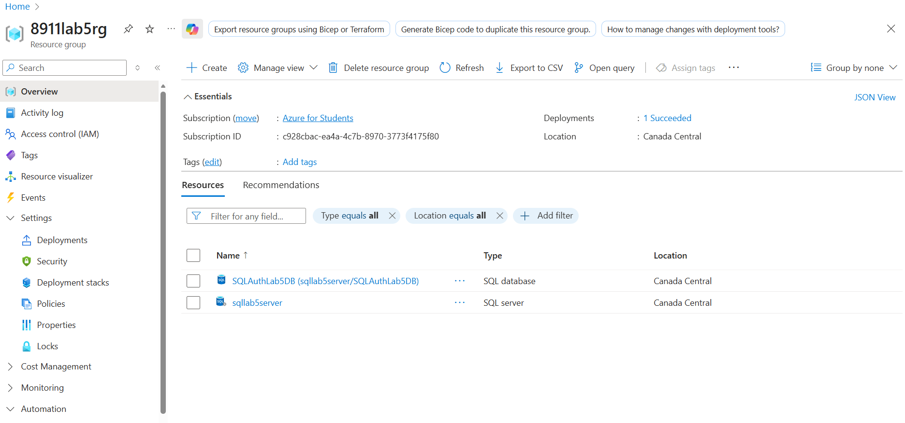
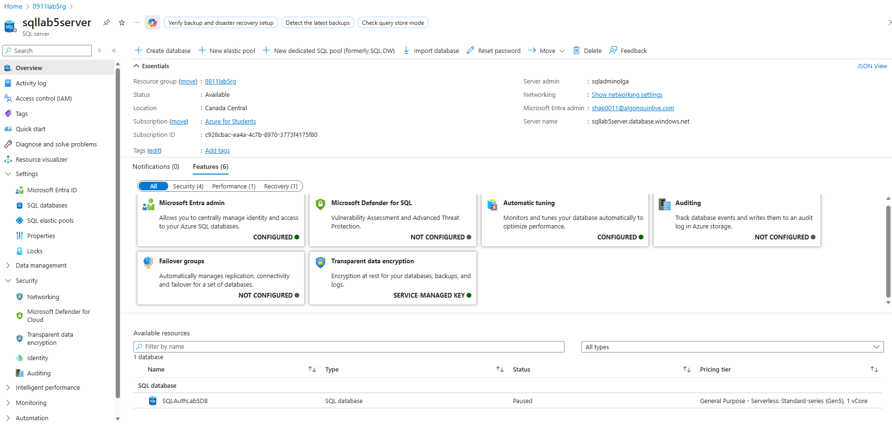
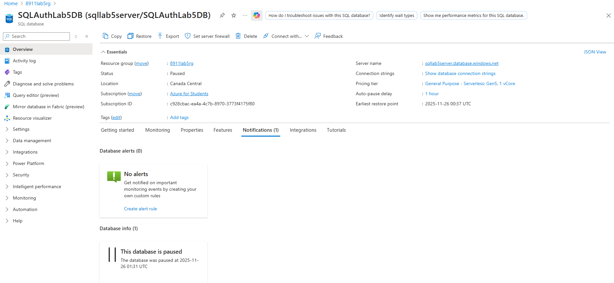

# Lab #5: SQL Databases

**Student: Olga Durham**

**Student#: 040687883**

---

# Prerequisites:

Download SQL Server Management Studio (SSMS) or Azure Data Studio in order to complete this lab

https://learn.microsoft.com/en-us/sql/ssms/download-sql-server-management-studio-ssms?view=sql-server-ver16

https://learn.microsoft.com/en-us/azure-data-studio/download-azure-data-studio?tabs=win-install%2Cwin-user-install%2Credhat-install%2Cwindows-uninstall%2Credhat-uninstall#download-azure-data-studio

---

# Complete the Tasks

1. Create a sql database with the ability to use both SQL and Microsoft Entra authentication to login. Create for development workload environment, select locally redundant backup storage /5

Subscription: `Azure for Students`

Resource group: `8911lab5rg`

Location: `Canada central`

Database name: `SQLAuthLab5DB`

Server name: `sqllab5server`

Authentication method: `Use both SQL and Microsoft Entra authentication`

Server admin login: `sqladminolga`

Password: `olga%durham25`

Microsoft Entra Admin: `shap0011@algonquinlive.com`

Compute + storage: `General Purpose - Serverless Standard series (Gen5), 1 vCore, 32 GB storage, zone redundant disabled`

Backup storage redundancy: `Locally redundant backup storage`

2. Login to the database using SQL Server Management Studio (SSMS) or Azure Data Studio using both Microsoft authentication to install and sql login to the database created in step 1 /10

3. Delete sql database and any other resources created /5

---

# Screenshots:

## Step 1:

- Screenshots must include each step of the creation of the azure SQL database and server specifically focused on the of workload environment, and if the right checkboxes were selected to allow both SQL and Microsoft Entra authentication. Any additional settings that are relevant that would allow you to sign in and any permissions that might need to be given to allow you to login for step 2, should also be included.

**Start creating new SQL database**

**Create SQL Database Server Setting**

**Create SQL Database Setting**

**New database and server deployed to resource group**

**Resource group overview**

**SQL server overview**

**SQL database overview**

## Step 2:

- Screenshot of the credentials being inputted to sign in via SQL login(username and password) and following result that you were able to sign in being shown as well

- Screenshot of the credentials being inputted to sign in via Microsoft Entra ie authentication and following result that you were able to sing in being shown as well

## Step 3:

- Screenshot of all resources being deleted
